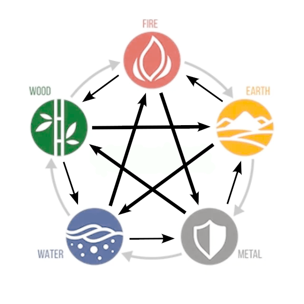

# ☯ The Elements

## Relations between the elements

First step in becoming a skillful fighter is gaining the knowledge of the five elements and their relations. There exist three possible types of relations between a given pair of elements:

* Dominating (thick black line)
* Overcoming (thin black line)
* Generating (gray line)

<figure><figcaption>
Relations between the five elements. Thick black lines denote <strong>dominating</strong> relation, thin black lines <strong>overcoming</strong> relation, and gray lines denote <strong>generating</strong> relation<strong>.</strong>
</figcaption></figure>

The fighter's mastery of a certain element is determined in the number of **attribute points** invested in that element. With each level fighters earn additional attribute points that can be spent as their master sees best fit. The attribute points determine the base damage, skill power and bonus strength of the specific element.

### Elements' actions

Each element has an associated **action** that the fighters can perform during the battle to deal damage to the opponent:

* Fire -> kick
* Earth -> punch
* Wood -> block
* Metal -> charge
* Water -> sweep

### Elements' bonuses

Additionally, each element is associated with specific **bonus**:

* Fire -> Bonus physical damage (+0.18 base physical damage per attribute level)
* Earth -> Bonus health (+1.2 max HP per attribute level)
* Metal -> Bonus focus (+0.1 base FP per attribute level)
* Water -> Bonus defense (+0.25 physical damage reduction per attribute level)
* Wood -> Bonus heal (+0.12 HP heal per attribute level)
