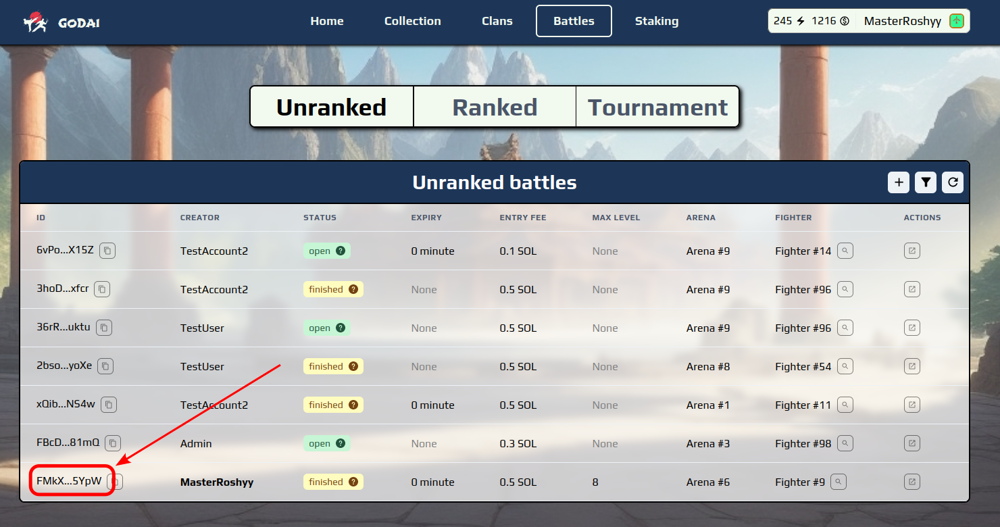
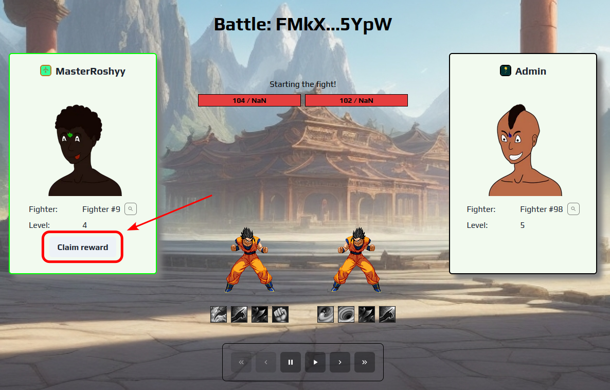

# 4⃣ Claiming rewards

After both users have joined a duel the battle will execute automatically. After the battle the user will be able to claim the rewards by clicking the battle "ID" field of a finished battle in battle list:

<figure><figcaption></figcaption></figure>

This will take you to the designated page where you can claim rewards by clicking the "Claim reward" button:

<figure><figcaption></figcaption></figure>

Congratulations!
