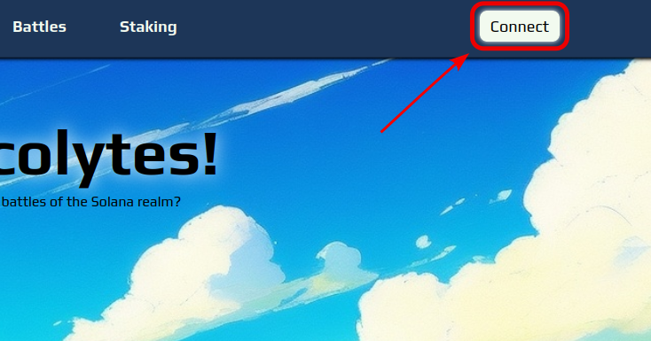

# 1⃣ Creating a clan

In order to start playing the game you will first need to create a clan. The clan creation dialog will appear automatically when you connect your wallet to the website for the first time by pressing the "Connect" button in the top right corner of the page:

<figure><figcaption></figcaption></figure>

To successfully create your clan you will need to enter your desired clan name and choose the clan banner. Clan name can be any string of 16 characters with no white spaces. Clan banner can be generated by choosing one of the available symbols and the colors of the symbol and the background.

