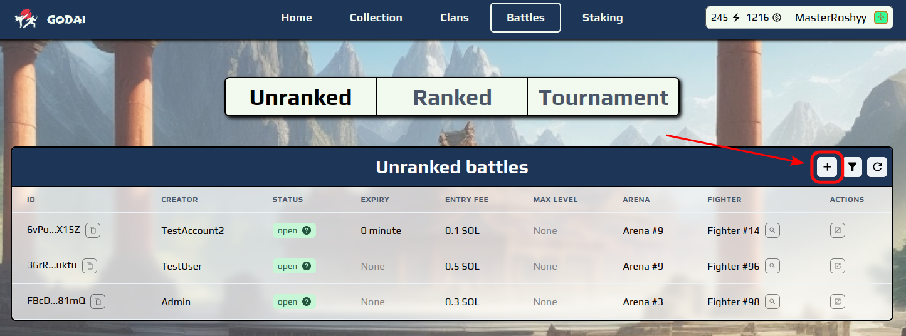

# 3⃣ Creating a battle

If you do not find any suitable existing battles you can always create a new one. The can be done by clicking the plus icon on the "Battles" page:

<figure><figcaption></figcaption></figure>

This will open the create battle menu, where you will have to choose the battle arena and set the following parameters:

* Entry fee: the fee payed by each entrant that will in the end be awarded to the winner
* Battle expiry (optional): the maximum allowed time for other players to join the battle (if you leave it empty the battle will have no expiry limit)
* Opponent (optional): the wallet address of the opponent that you wish to challenge (if you leave it empty anybody can join the battle).
* Max level (optional): the maximum level of the opponent's fighter (if you leave it empty the opponent will be able to chose from fighter of equal or lower level than your selected fighter)

Once you have configured the battle you can proceed by clicking the "Create" button. This will take you to the designated battle page, where you can join the battle like described in the previous section.
