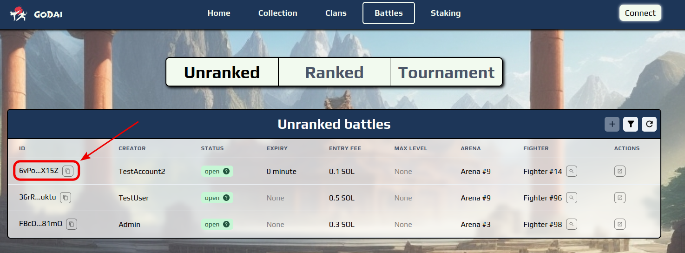
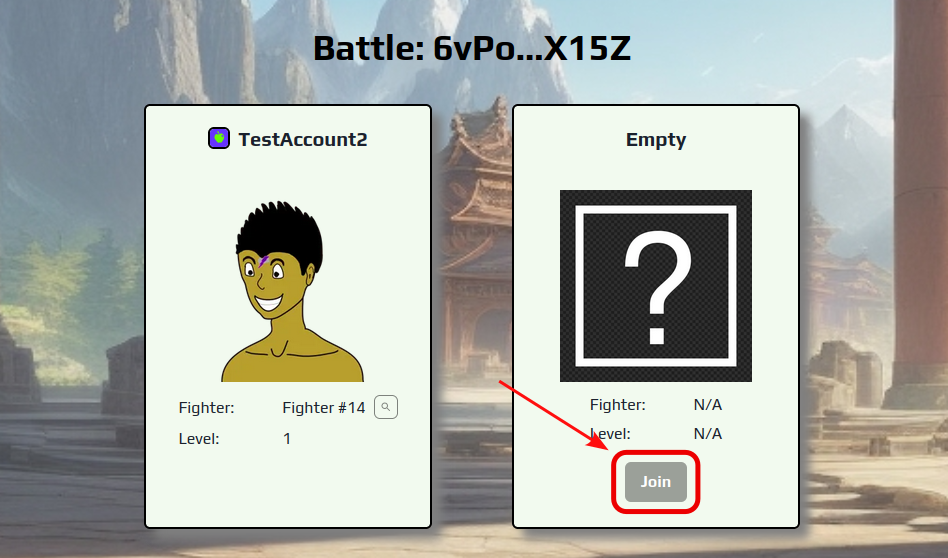

# 2⃣ Joining a battle

Battle represent the key aspect of the game. The easiest way to engage in a duel is to join an existing battle. This can be achieved by navigating to the "Battles" page and choosing one of the open battles from the list by clicking its "ID" field:

<figure><figcaption></figcaption></figure>

This will take you to the page that is designated for the selected battle. Once there, you can review your opponent, his selected fighter and join the battle using the "Join" button:

<figure><figcaption></figcaption></figure>

When you click the "Join" button, it will open a menu where you will have to choose your fighter and devise a battle build. The build consists of a sequence of 12 actions, which can be entered using number keys 1 - 5, and up to 4 optional skills that have been unlocked by the selected fighter. Once you have chosen your prefer build you can confirm it by clicking "Save".

More information about the actions and skills can be found here:


[key-battle-concepts.md](../about/game-mechanics/battle-system/key-battle-concepts.md)

